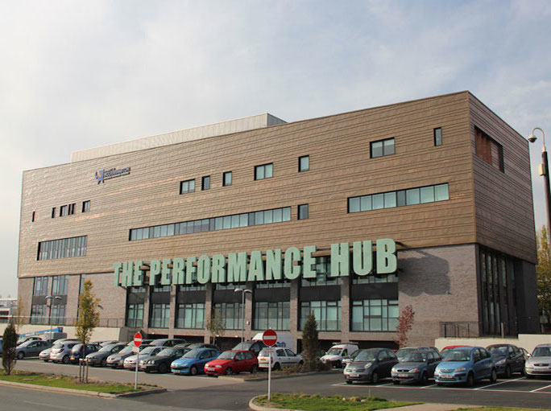
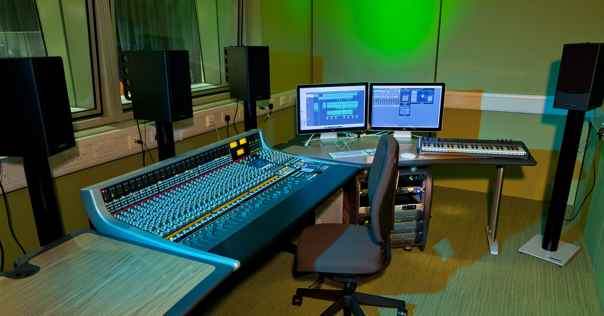

University of Wolverhampton Department of Music and Music Technology Studio Report

+-----------------------------+-----------------------------+-----------------------------+
| Mat Dalgleish               | Matt Bellingham             | Aglaia Foteinou             |
+-----------------------------+-----------------------------+-----------------------------+
| Faculty of Arts             | Faculty of Arts             | Faculty of Arts             |
|                             |                             |                             |
| University of Wolverhampton | University of Wolverhampton | University of Wolverhampton |
|                             |                             |                             |
| m.dalgleish2\@wlv.ac.uk     | matt.bellingham\@wlv.ac.uk  | a.foteinou\@wlv.ac.uk       |
+-----------------------------+-----------------------------+-----------------------------+

ABSTRACT

This Studio Report attempts to summarise the ethos of and goings on in the University of Wolverhampton's Department of Music and Music Technology during the academic year 2013-2014, with an emphasis on Music Technology. In particular, it describes a shift from a focus on studio production and live sound towards music computing at undergraduate and postgraduate level.

# INTRODUCTION 

The origins of the Music department at the University of Wolverhampton date back exactly 70 years to 1945, but can be most readily traced to the amalgamation of three teacher-training colleges in the West Midlands into Wolverhampton Polytechnic in the 1970s. Of the three, Dudley College of Education and Wolverhampton Day College of Education had substantial Music departments and initially taught syllabuses validated by the University of Birmingham. These were replaced in 1981 by a B.Ed. degree course featuring modules in practical music performance, analysis and composition. Under the guidance of Keith Jackson and Bill Inglely, the Polytechnic soon developed a new BA Music degree. To this end, new modules in jazz and "music of non-European Origin" joined established modules. Nevertheless, in spite of these changes, an emphasis on practical music teaching remained. After branching out into music courses for Hong Kong teachers in the late 1980s, university status arrived in 1992. A particular focus on World music followed. This involved contact and collaboration with the likes of the University of Central England, Dartington College, Midlands-based traditional Indian music groups and Chinese musicians recruited through existing contacts in Hong Kong \[1\].

In 1996-7 a joint Music and Popular Music degree was convened, but a move to the newly formed School of Sport, Performing Arts and Leisure (SSPAL) delayed the creation of a specialist Popular music degree until 2002. The specialist course focused on performance, but also included subjects such as music theory, transcription, song writing, and a limited amount of music technology. Moving with the times, a joint Popular Music and Music Technology degree was created in 2006 followed by a specialist Music Technology degree in 2008. Meanwhile, masters-level programs in Music have run since the 1990s, and in Music Technology since 2007. Thus, the taught offerings of the Department of Music and Music Technology as it stands today are:

-   BMus Music
-   BMus Music and Popular Music (joint)
-   BMus Popular Music
-   BMus Popular Music and Music Technology
-   BA (Hons) Music Technology
-   MMus Music
-   MSc Audio Technology

During this time there have also been numerous PhD students in music-related subjects, based within the Centre for Art and Design Research and Experimentation (CADRE).

# FACILITIES

## Building

In September 2011, the Department of Music and Music Technology moved into the newly constructed Performance Hub building (below) at the University's Walsall campus.

A purpose-built facility, the Performance Hub features a 120-seat black box theatre that doubles as a performance venue and independent cinema, academic library, and three floors of specialist performing arts spaces.

## Studios and Labs

The Music technology facilities are primarily located around the top floor of the Performance Hub. These include; one recording studio built around an SSL AWS 948 console, 48 channel Pro Tools HD audio interface, and PMC 5.1 monitor array; one recording studio built around an SSL Matrix II console, 32 channel Pro Tools HD audio interface, PMC IB2 stereo monitors, and extensive outboard gear; a 5.1 surround array-equipped critical listening suite; two computer labs with 40 and 20 iMac machines respectively, 2x2 audio interfaces and MIDI keyboards.

Additionally, there are 5 ensemble/large group rooms and 12 smaller practice cells with audio tie lines to the two recording studios. An Allen & Heath iLive console and DANTE network add-on provide similar functionality for the black box theatre. 360-degree panoramic images of most of these facilities can be seen here \[2\].

## Software

A range of software is used depending on the task in hand. For instance, Apple Logic X and Pro Tools 10/HD 3 are the mainstay Digital Audio Workstation (DAW) software, but these are supplemented by a host of more specialised software tools such as Sonic Visualiser, the audio programming environments Pure Data (Pd) and SuperCollider, and the Unity game engine. Two main principles guide software selection. First, files need to be interchangeable between the facilities detailed above. For instance, work started in the labs can be finished in the studios or listening room (or the other way round). Second, open source software is favoured wherever it is at least comparable in terms of features and reliability to closed, proprietary alternatives.

# EDUCATION 

## Undergraduate 

At its inception in 2008, the influence of the joint Popular Music and Music Technology degree on the BA (Hons) Music Technology curriculum was palpable. Popular music-orientated studio production and live sound provided the backbone of the specialist course, supplemented by acoustics, study of the music industry, and a modest amount of audio synthesis. Since the authors joined the department in September 2010, August 2012 and January 2014 respectively, significant changes have occurred. Firstly, between 2010 and the academic year 2013-14 the number of specialist Music Technology students grew from around 10 to more than 120. Then there was the move to the larger and better-equipped Performance Hub in September 2011. However, the most significant changes have been the result of a shift in ethos and curriculum. Most notably, Music Technology at the University of Wolverhampton has become markedly more music computing-centric. In parallel to this, it has also gained accreditation by the Joint Audio Media Education Support (JAMES), a UK-based non-profit organization made up of industry members of the Association of Professional Recording Services (APRS), the Music Producers Guild (MPG) and UK Screen \[3\].

This shift in direction has its roots in two related tropes. First, the music-capable and internet-connected personal computer has spread to the point of ubiquity, providing far greater access to music technologies. Second, easy-to-use software has offered production and distribution functionality that was once confined to professional recording studios and music industry facilities. In other words, the computer has become an accessible, all-in-one music solution. The paradox is that, on one hand, these conditions have created something of a perfect storm for the old music industry and its structures, also severing many associated routes of employment. On the other hand, Music Technology has adapted and flourished; the computer as a kind of proxy enabling core skills of music technologists to be transferred into new, diverse and sometimes under-explored areas. A non-exhaustive list of these includes Human-Computer Interaction (HCI), software development, audio-visual performance, interactive media, and video games.

With the computer assuming a central role, a key question becomes: Should we accept and rely on the tools provided by others, or do we develop and shape our own? To paraphrase Rushkoff \[4\], the first option positions music technologists merely as passengers who are subject to the whims of developers and companies who may care little for musical or audio needs. Additionally, it also closes off many of the newer career paths mentioned above. By contrast, the second option offers the possibility of empowerment and independence; the ability to shape the path of one's self and the community. It is therefore vital that programming (i.e. the ability to write code) be recognized as a key literacy of the digital era. Indeed, Manovich \[5\] notes that: "Software has become a universal language, the interface to our imagination and the world." Our own perspective is that by emphasizing not only the use of software tools, but also the ability to make useful tools for oneself and others, we hope to prepare students to contribute to a rapidly evolving field.

However, as a relatively mature technology, the computer is no longer particularly interesting in and of itself \[6\]; instead, its appeal for music technologists lies primarily in its ability to enable the transfer of conceptual foundation across previously disparate domains (i.e. as a platform for doing things). Thus, the importance of first principles has not been diminished by the computer, and perhaps even increased. These principles are in the area of what Loy \[7\] terms 'musimathics,' and relate to a blend of the intrinsically connected fields of acoustics, music theory, and synthesis. In this expanded realm of contemporary Music Technology, musimathics underpins all areas of activity, from sound recording to audio programming. These areas of study are shown below (Figure 3.).

These four interconnected strands run permeate Levels 4-6 (i.e. years 1-3) of the undergraduate program. Creative Computing includes generative music, audio synthesis and digital signal processing, and musical interface design. Audio Production includes sequencing, studio tracking, mixing, and mastering. Research and Theory provides foundation in acoustics, music theory, research methods, academic writing, and project design. Employability considers the post-digital music business, its problems and opportunities.

Particular consideration is given to the constructive sequencing of modules. For instance, study of acoustics and properties of sound is undertaken at Level 4 in parallel with an introduction to audio programming via the Pd visual programming environment. This enables acoustical ideas to be tested in code. At Level 5, this proficiency with code is simultaneously used to explore, and furthered by exploration of, fundamental audio synthesis and processing techniques (i.e. one reinforces the other). These techniques are then applied to a video game context using the text-based Supercollider programming language. In addition to exploring the video game sound context, this also aims to expose students to contrasting programming paradigms. In the final year, possibilities for real-time interaction with sound-synthesis processes are explored in depth. Applications range from digital musical instruments to pragmatic studio tools and assistive technologies.

## Postgraduate 

The MSc Audio Technology builds on the undergraduate themes to focus on three areas.

Music Computing includes the study of human perception and cognition of sound, the ways in which computers can analyse audio, audio synthesis and re-synthesis, generative musical processes, and how these processes can be applied to the generation and transformation of audio.

Musical HCI investigates the work carried out over the last decade by the New Interfaces for Musical Expression (NIME) community. Using appropriate physical and embedded computing technologies, students design and implement a musical interface for a chosen real-time application, and apply HCI-inspired evaluation methods. Typical applications include musical pedagogy, composition, performance, and interfaces for disabled users. Particular attention is devoted to the documentation and dissemination of hybrid physical-digital artefacts, and coverage of issues around Open Source and Creative Commons licensing.

Studio Practice explores a diverse mixture of methodologies employed in the planning, recording, editing, mixdown and mastering stages of audio production. In particular, students conduct research into genre and equipment-specific working practices, leading to the development of innovative engineering concepts and techniques. They are required to critically evaluate a variety of software and hardware tools and produce work in both stereo and surround sound.

The course culminates in a substantial and self-directed final project. Innovative projects are encouraged, and there exists the potential for interdisciplinarity and collaboration with practitioners in other fields.

# RESEARCH 

With an influx of postgraduate students, new staff member and significant development work, several projects have seen significant advances over the last year.

Mat Dalgleish has continued to develop the Postrum posture aid for trumpet players. This aims to improve performance and reduce the occurrence of injuries. Moving on from an initial prototype that utilized haptic feedback only \[8\], the latest incarnation investigates the use of a mixed modality feedback system that melds haptics to an ambient visual display. He has also designed two new digital musical instruments, including one for *Desire Lines* by Chris Foster; a composition for trumpet, prepared piano and live electronics. Most recently, Mat has recently become Director of Studies for the PhD project of Chris Payne. This examines the musical use of visual programming environments such as Pd within the UK compulsory education sector. Aside from these activities, Mat continues to work on a book about West Coast-inspired approaches to sound-synthesis.

Working with the Music Computing Lab at the Open University, Matt Bellingham's research is concerned with user interface design for the democratization of end-user algorithmic software. His recent research includes an analysis, using Cognitive Dimensions, of a representative selection of algorithmic composition software user interfaces, and discussion of the transfer of patching metaphors to the digital domain. He is currently creating a series of prototypes in SuperCollider that explore the notion of "slapability" in algorithmic music interfaces.

Focusing on the reconstruction of heritage sites and the revival of their acoustics for posterity, Aglaia Foteinou is currently working on measuring the acoustic characteristics and acoustic simulation of heritage sites in the West Midlands area. These results can be applied to virtual acoustic reconstruction of spaces, including in contexts such as game audio and film sound. Her research also includes the investigation of techniques for measuring the absorption coefficient of surfaces in-situ. Once the most suitable technique is established, more accurate simulations can be achieved.

Other notable recent projects include a multi-channel AV piece based on a swarm algorithm by Alex Dudley, a tactile controller made from capacitive foam by Jamie Downes, and an augmented keyboard instrument by Richard Burn.

# THE FUTURE

Music Technology is a relatively recent addition to the seventy-year-old Music at the University of Wolverhampton but it has grown significantly in size and evolved considerably since its inception. One of the most exciting future prospects relates to the recent formation of a modest-sized postgraduate laptop ensemble. It is distinctive in that it makes extensive use of physical computing technologies for sound output and performer-instrument feedback as well as input. In the short-term this ensemble is intended as a test bed for compositional and music interaction work. If successful, it may be expanded to involve the undergraduate programme in due course.

Acknowledgments

We would like to thank all of the staff and students of the University of Wolverhampton's Department of Music and Music Technology past and present. Thanks also to John Crossley, Byron Dueck, Gary Bromham, and JAMES.

# REFERENCES

1.  K. Jackson, *Music at Wolverhampton Polytechnic before University Status in 1990/1991*. University of Wolverhampton internal document, 2008.

2.  Anon., *Performing Arts 360 views*. Accessed 27 January 2015. \[Online\]. Available: http://www.wlv.ac.uk/about-us/our-schools-and-institutes/faculty-of-arts/school-of-performing-arts/facilities/360-views/

3.  JAMES, *JAMES: A Working Partnership Between Industry and Education*. Accessed 27 January 2015. \[Online\]. Available: http://www.jamesonline.org.uk/

4.  D. Rushkoff, *Program or Be Programmed: Ten Commandments for a Digital Age*. OR Books, 2010.

5.  L. Manovich, *Software Takes Command*. Bloomsbury Academic, 2013.

6.  K. Cascone, "The Aesthetics of Failure: "Post-Digital" Tendencies in Contemporary Computer Music." *Computer Music Journal*, vol. 24, no. 4, pp. 12--18, 2000.

7.  G. Loy, *Musimathics: The Mathematical Foundations of Music: 1*. The MIT Press, 2011.

8.  M. Dalgleish and S. Spencer, "Postrum: Developing Good Posture in Trumpet Players Through Directional Haptic Feedback," *Proceedings of the 2014 Conference on Interdisciplinary Musicology (CIM14), Berlin*, 2014, pp. 204-208.
