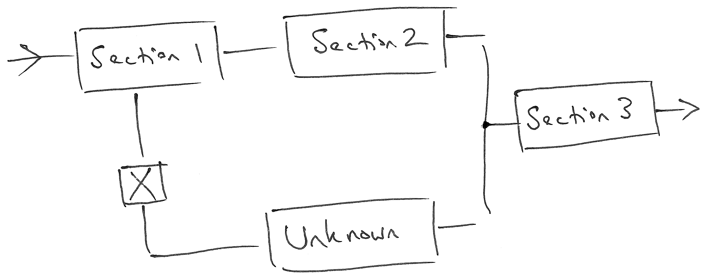
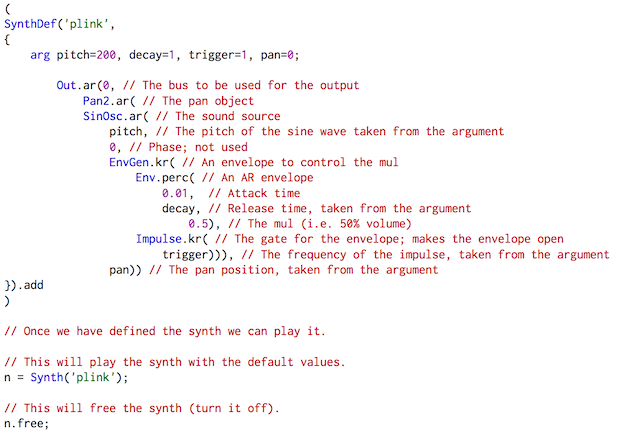
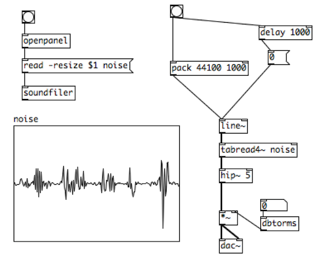
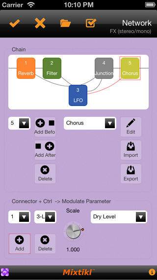
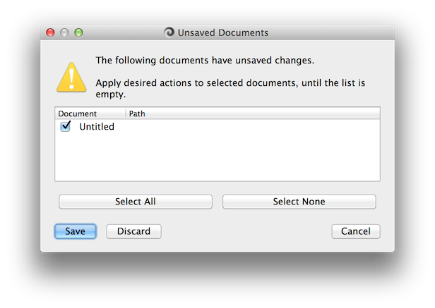
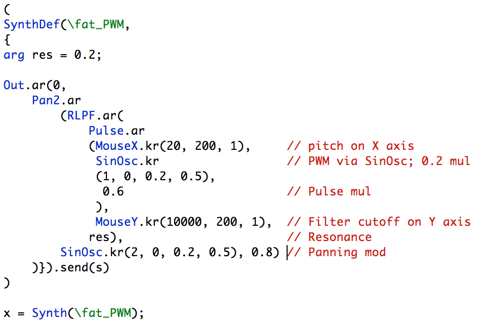
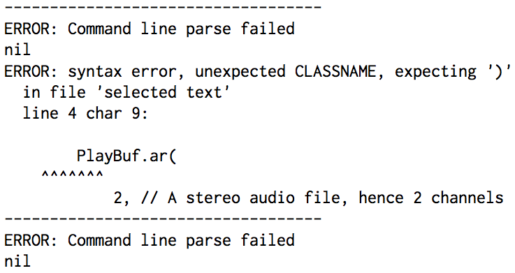
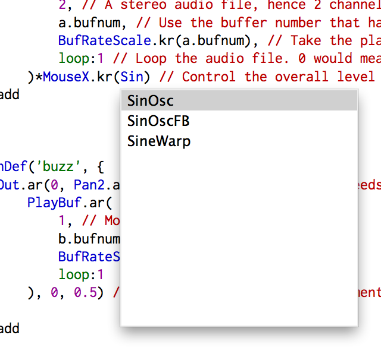
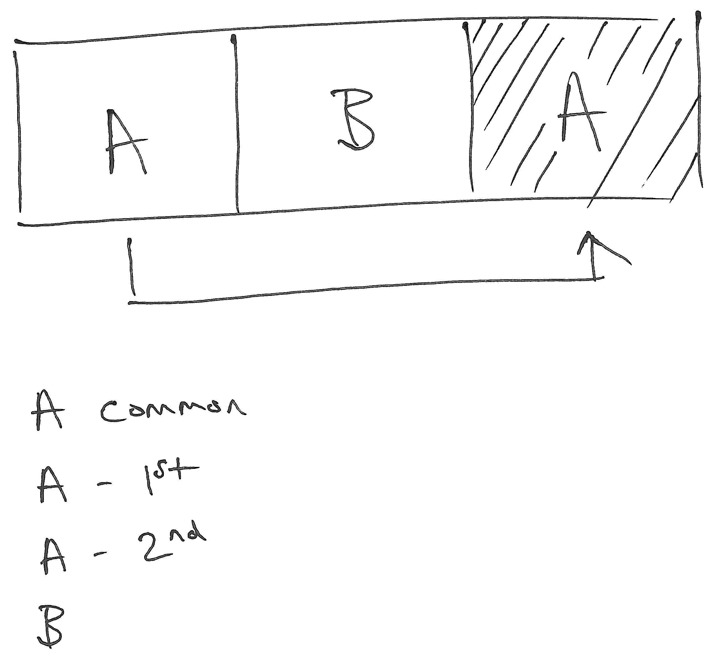

% An analysis of algorithmic composition interaction design with reference to Cognitive Dimensions

**Matt Bellingham**  
Department of Music and Music Technology, Faculty of Arts, University of Wolverhampton  
matt.bellingham@wlv.ac.uk

**Simon Holland**  
Music Computing Lab, Centre for Research In Computing, The Open University  
simon.holland@open.ac.uk

**Paul Mulholland**  
Knowledge Media Institute, Centre for Research in Computing, The Open University  
p.mulholland@open.ac.uk

# Abstract {-}

This paper presents an analysis, using Cognitive Dimensions [@Blackwell:2003aa], of a representative selection of user interfaces for algorithmic composition software. Cognitive Dimensions are design principles for notations, user interfaces and programming language design, or from another viewpoint 'discussion tools' for designers [@Green:1998aa]. For the purposes of this report, algorithmic composition software is software which generates music using computer algorithms, where the algorithms may be controlled by end users (who may variously be considered as composers or performers). For example, the algorithms may be created by the end user, or the user may provide data or parameter settings to pre-existing algorithms. Other kinds of end-user manipulation are also possible. A wide variety of algorithmic composition software is considered, including visual programming languages, text-oriented programming languages, and software which requires or allows data entry by the user. The paper considers a representative, rather than comprehensive, selection of software. The analysis also draws, where appropriate, on related discussion tools drawn from Crampton Smith [@Moggridge:2006aa], @Cooper:2007aa and @Rogers:2011aa. Finally, the paper reflects on the compositional representation of time as a critical dimension of composition software that is not satisfactorily addressed by Cognitive Dimensions, or any of the other discussion tools.

Introduction
=====

The paper considers all fourteen Cognitive Dimensions in turn, using each dimension to illuminate design issues in a wide variety of user interfaces for algorithmic composition. Finally, issues in interaction design for algorithmic composition that are arguably not well addressed by Cognitive Dimensions, such as the compositional representation of time, are considered.

Viscosity
=========

Viscosity is a measurement of the software's resistance to change, or how easily the user can change a patch once it has been written. *Repetition viscosity* is caused when the software requires several actions to achieve a single goal. *Knock-on viscosity* is created when a change is made and the software requires further remedial action to restore the desired operation [@Green:1998aa].

Visual patching languages such as *Max* [@Cycling-74:2014aa[^max]] and *Pure Data* [@Puckette:2014aa] can become highly viscous. Connections are made with virtual patch cables, and when there are multiple connections the patch can become difficult to read and work with (sometimes referred to as 'spaghetti').

[^max]: *Cycling '74* is the name of the company that produces *Max*.

![Dense connections in *Pure Data* [@Farnell:2008aa], creating visual 'spaghetti' which increases viscosity](assets/pure_data-workshop.png)

The use of subpatches can ameliorate some viscosity issues. Subpatches allow the programmer to create objects with inlets and outlets which can abstract and simplify a patch at a given level. Subpatches can also be used to easily copy material, further reducing repetition viscosity. Abstracted connections ('send' and 'return' objects, for example) allow for non-visual connections with an increase in search cost (see *hidden dependencies*).

The structure of a piece of music, depending on the genre, can be a crucial element of the composition. If the genre requires a strongly structured piece there will be a conceptual structure (ABA, for example). An interface which matches the user's conceptual structure will reduce both repetition and knock-on viscosity. @Cooper:2007aa suggest three separate models for the perception of software; the *implementation model* of the software (how it works), the user's *mental model* (how the user imagines the software to work) and the *representational model* of the software (what the software shows the user). Repetition viscosity could be significantly reduced by better matching the mental model to the representational or implementation models. For example, if the implementation model made use of repeating sections the user could apply a change to the section and it would play back correctly both times. If the representational model showed repeating sections (as visual blocks, for example) and then relayed the changed material to all relevant repeats in the implementation layer, the user would input the desired changes once and they would be propagated out to the playback system (see *Provisionality*).

Some text-oriented programming languages such as *Csound* [@Vercoe:2013aa] and *SuperCollider* [@McCartney:2012aa] allow the user to create elements that can be easily reused and redefined. Such polymorphism (either ad hoc or parametric depending on context) can reduce repetition viscosity as changes in the variable's parameters will cascade to all instances. The 'rules' implemented in *Noatikl* [@Intermorphic:2012aa] allow for a reduced viscosity via cascading changes in a similar way. Knock-on viscosity can be created by introducing wide-ranging changes in this way.

There are links between viscosity and another of the dimensions, *premature commitment*. Premature commitment refers to situations in which the user has to make a decision before they have access to all relevant information. A piece of software with high viscosity makes it hard to amend work once it has been started. It is reasonable to assume that many compositions start with sketches that develop; high viscosity, such as is found in visual patching software, makes such development difficult.

Viscosity in software is not necessarily a negative attribute. Highly viscous software can present a user with a single, stable, well defined use-case. An example of this is *Wolfram Tones* [@Wolfram-Research-Labs:2011aa] which presents the user with a limited control set as a 'black box' [@Rosenberg:1982aa]. Another example is *Improviser for Audiocubes* [@Percussa:2012aa], in which the complexity of the performance is generated by the physical layout of the Audiocubes [@Percussa:2013aa]. As a result, keeping the sequencing interface simple avoids over-complicating the composition and performance processes. This simplicity, however, increases the viscosity and arguably limits compositional opportunity.

Live coding (editing code while it generates sound) requires software with a low viscosity. Elements need to be individually controllable with an efficient syntax, low repetition viscosity and minimal knock-on viscosity. *Impromptu* [@Sorensen:2010aa] is a Lisp-based environment which allows for the real-time creation and control of objects. *Usine* [@Sens:2013aa] has a GUI which allows for mouse and keyboard control, with a graphical signal flow based on a modular synthesis concept.

Abstraction
===========

<!--
> The definitions in the section on abstraction suggest that abstraction is "closely aligned with semantic meaning" and "effectively match the user's mental model." However, these seem more like a definition of closeness of mapping.
-->

An abstraction presents the user with a representation which is closely aligned with the semantic meaning of the entity. The implementation of the entity is hidden, or *abstracted*. The *abstraction barrier* [@Green:1998aa] describes the number of abstractions the user must master before using the software. Graphical languages typically have a lower abstraction barrier than text-based languages. Green and Blackwell describe three classes of software; *abstraction-hungry* systems which require user-defined abstractions, *abstraction-tolerant* systems which permit them, and *abstraction-hating* systems which do not allow them [-@Green:1998aa].

<!--
> What is the evidence or justification for saying that graphical languages "typically" have a lower abstraction barrier?
-->

Many of the text-oriented languages used in the space, such as *Impromptu* [@Sorensen:2010aa] and *SuperCollider* [@McCartney:2012aa], are abstraction-hungry. They frequently also have a high abstraction barrier as they require the user to learn the syntax and abstractions used. An example of abstraction-tolerant software is the *Algorithmic Composition Toolbox* by Paul Berg [-@Berg:2012aa], which presents objects to the user and allows the creation of new abstractions. The software makes use of musical metaphors (such as a rudimentary piano roll) for some elements. The user defines objects such as sections, shapes, masks and note structures which the program's 'generators' use to create new material. A selection of software in the field do not require the user to interact with the method of generation; these are abstraction-hating systems. Robert Walker's *Fractal Tune Smithy* [-@Walker:2011aa] and Jonathan Middleton's *Musical Algorithms* [-@Middleton:2004aa] both require musical input which is then acted on using algorithms which are both hidden from, and inaccessible to, the user.

Abstractions can be used to make software more effectively match the user's mental model [@Cooper:2007aa]. Multiple steps can be combined to make the software conform to the user's expectations. Such abstractions can make use of a metaphor such as the hardware controls of a tape machine. The processes involved in saving the play state, halting and saving sound generation and effects processing, and then reloading the state to allow the track to continue need to be abstracted to reinforce the metaphor. The metaphor imposes some of the characteristics of a tape machine: the tape is in motion, stopped, and then resumes playback from the same place when set into motion.

Other hardware metaphors are used in current algorithmic composition software. The *Cylob Music System* by Chris Jeffs [-@Jeffs:2010aa] makes use of step-sequencer and drum machine designs, among others.

![The drum machine interface from the *Cylob Music System* [@Jeffs:2010aa]](assets/drum-machine.cms_seq_drummachine_seq.png)

There are several music metaphors used in the software in the field which require the user to be conversant in music theory. *Harmony Improvisator* [@Synleor:2013aa] requires input in the form of scales, chords and inversions. *Noatikl* [@Intermorphic:2012aa] uses abstractions to create what it refers to as 'Rule Objects' ('Scale Rule', 'Harmony Rule', 'Next Note Rule' and 'Rhythm Rule') to control how the software generates patterns. The *Algorithmic Composition Toolbox* [@Berg:2012aa] makes reference to note patterns and structures. Roger Dannenberg has explained how staff notation is rich in abstractions [-@Dannenberg:1993aa]; software which uses elements of staff notation is building abstractions on top of abstractions.

![Lars Kindermann's *MusiNum* [-@Kindermann:2006aa]](assets/musinum2.png)

Abstraction has a link to *visibility*, another of the Cognitive Dimensions. A high level of abstraction can result in low visibility. An effective design would be for the software to have a low abstraction barrier but be abstraction-tolerant. Such a design would allow new users to work with the language without writing new abstractions, while more advanced users could write abstractions when appropriate.

Hidden Dependencies
===================

Hidden dependencies occur when important links between entities are not fully visible. There is a *search cost* which reflects the effort required to locate the dependency [@Green:1998aa].

There are two types of links made in the software under consideration; one-way and symmetric. One-way links send data, whereas symmetric links can both send and receive information. One-way links, such as a send object in *Pure Data* or a variable in *SuperCollider*, do not reflect changes made elsewhere in the system. The patch-cable metaphor used in visual programming languages makes one-way dependencies explicit and reduces the potential for hidden dependencies. Visual audio programming systems typically use a patch cable metaphor and, as the majority of physical patching utilises a unidirectional (i.e. audio send or return) rather than bidirectional (i.e. MIDI, USB) connection, software such as *Max* and *Pure Data* retains a one-way connectivity metaphor. Visual patching systems allow users to see links at the potential expense of increased premature commitment.

Both graphical and text-oriented languages can make use of variables and hidden sends and returns. If users are required to check dependencies before they make changes to the software the search cost is increased. This in turn can lead to higher error rates (via knock-on viscosity). Abstractions can impose additional hidden dependencies; users may not be able to see how changes will affect other elements in the patch.

Premature Commitment
====================

Premature commitment refers to constraints on the order of operation, which leads to the user making a decision before all relevant information is available. *Enforced lookahead* describes how the user is forced to decide on implementation detail before they would otherwise be ready to [@Green:1998aa].

While experienced users can leverage their understanding of a piece of software to minimise premature commitment, less experienced users may have to rewrite a patch as it develops. Alan Cooper refers to 'survivors' [@Cooper:2004aa]; those who manage to use software but find the process of composition is made more difficult by the limitations of the tool. He describes the cognitive dissonance caused by tension between the user's mental model and the implementation and/or representational models [@Cooper:2007aa]. The software can dictate the way the composer writes.

Most software in the algorithmic space allow links to be made only between pre-existing entities. In these cases the user is unable to say 'I don't know what is going here', which can be a useful option when composing. One possible solution to this problem would be to decouple the design of the patch/composition from the actualisation. This could take the form of a graphical sketching tool which would allow the user to test the structure and basic design of the patch.

There is a link between premature commitment and the viscosity of the programme; if viscosity is low then the user can redesign their patch with relative ease. Graphical systems such as *Noatikl* show the order of actions using a signal flow analogy which offers an easy way to reorder, thereby reducing viscosity.

@Green:1996aa introduce two subsets of premature commitment; *commitment to layout* and *commitment to connections*. Graphical systems such as *Max* encourage users to start with one element and then expand the patch. This forces the user to commit to the layout, and as the patch grows in complexity the viscosity of the software can limit subsequent changes. Graphical systems suggest a commitment to connections as significant planning is needed to design a flexible patch. A simple patch using a patch-cable analogy can be easily readable, but increased complexity can lead to a visually congested patch which is hard to maintain. This leads to higher viscosity.

Secondary notation
==================

Secondary notation refers to extra information conveyed to the user in means other than the formal syntax [@Green:1998aa]. Examples of secondary notation are in the collection of controls in *Mixtikl* [@Intermorphic:2013aa] and in the design of the *Cylob Music System*. Information conveyed by placement is known as *escape from formalism* [@Green:1998aa]. The spacial placement of the controls adds to the information available, making the device easier to learn.

![Filter controls in *Mixtikl* [@Intermorphic:2013aa]](assets/mixtikl1.png)

Both *Max* and *Pure Data* allow for graphical elements (such as colour, fonts and canvas objects) to be added to patches. *Max* is particularly flexible when implementing secondary notation, as seen in the patches created by *Autechre*'s Rob Brown and Sean Booth [@Tingen:2004ab].

![An example *Max* patch taken from Autechre's *Confield* [@Tingen:2004ab]](assets/autechremax2.jpg)

Another example of secondary notation is code indentation; Green refers to this as *redundant recoding* [-@Green:1998aa]. Indentation helps to improve legibility and comprehension when reading and writing code. Indentation is used in all of the text-oriented languages under review. Object-oriented languages (such as *SuperCollider*) and XML-based syntax (such as that used in *SoundHelix* by Thomas Schürger [-@Schurger:2012aa]) make significant use of the placement and context of commands for both the readability and functionality of the code. Adding comments to code is another example of secondary notation, and all of the musical programming languages under consideration allow for commenting.

There is a link between secondary notation and viscosity. If a patch's structure is changed the secondary notation (such as the placement of controls) can also be affected. The design of the patch therefore needs to include the required secondary notation which will lead to a higher viscosity due to the lack of flexibility in future changes.

Visibility
==========

*Visibility* is the ability to view components easily. *Juxtaposability* is the ability to view two components simultaneously; this can be useful when comparing two elements [@Green:1998aa]. There is a balance to be struck in composition software between having too much information and not having enough to complete a given task. Key parameters must be made visibile without introducing clutter to the design. An example of a high level of both visibility and juxtaposability is the layout of the *Cylob Music System*; several 'layers' of the software allow for multiple parameters to be compared and controlled.

Default settings are not always directly visible. *SuperCollider*, for example, has defaults for every unit generator but they are only visible within the help files (see image). The parameters are explicitly visible when the user issues them as methods but the method order (i.e. which parameter is controlled by each command) is again only visible in the help files. An experienced user will memorise the method order but this lack of visibility has an impact on the novice user.

The user needs to be informed of their current position in the control tree. Software such as *Mixtikl* shows the current position by having a main view and using windows to access specific elements. Animation and placement denote the layer of the interface that is currently open. *Pure Data* allows users to create subpatches that open in successive layers on the screen; the user can use the 'Window' menu to view the open windows and to move to a specific place but the interface lacks a clear 'breadcrumb'-like structure [@Adkisson:2005aa].

Form-based data entry, as used in software such as *Tune Smithy* and the *Algorithmic Composition Toolbox*, allows the user to review multiple parameters simultaneously. Such designs do not allow the user to see older entries as they are replaced, which has a negative impact on the juxtaposability of the software. The user is asked to remember the old settings, increasing the work required of the user [@Cooper:2007aa].

![The form-based interface of *Fractal Tune Smithy* [@Walker:2011aa]](assets/fractal-music-generator.png)

Data flow visibility is variable in the software under consideration. Graphical languages such as *Max* and *Pure Data* can exhibit excellent data visibility within single patches, although the use of send and receive objects can impact on this. *Noatikl* and *Mixtikl* show data flow very clearly. Visibility in text-oriented systems is lower and the user may have to wireframe the patch separately before creating the code.

![Data connection in *Noatikl* [@Intermorphic:2012aa]](assets/noatikl.png)

Closeness of mapping
====================

<!--
> The definition of closeness of mapping is unusual, in suggesting that a close mapping should be *distant* from the user's mental model. The assumption seems to be that the mapping is only explored in relation to the programmer, and not to the user. However, what if the user *is* the programmer? (Or in the case of music systems, as here, what if the person using the notation is also the music composer). This programmer-centric interpretation seems to have missed the point, of "closeness of representation to domain" (definition from Blackwell & Green 2003). If the user's domain happens to be machine operations (i.e. the user is a technical programmer), then the observations made in the paper hold true. But since the paper is about musicians, the closeness of mapping ought to be closeness of mapping to the music domain, in which case the argument in this section is the opposite of the usual interpretation.
-->

Mapping refers to the correlation between the interface and the actual tasks being performed by the software. A close mapping [@Green:1998aa] is modelled on the implementation model [@Cooper:2007aa]. In this case the software directly represents the way the software works, rather than abstracting this information. An example of this is *Pure Data* [@Puckette:2014aa]. Some operations require the user to understand processes which are normally abstracted; for example, if a user is to play an audio file they need to create a `line~` object to play each sample of the audio file in the required time. *Pure Data* also contains a large number of abstractions which represent a more distant mapping.

A distant mapping [@Green:1998aa] presents a significantly different representation model [@Cooper:2007aa], potentially requiring the use of new concepts. Distant mapping allows the interface to better match the user's mental model [@Cooper:2007aa]. An interesting example of this is *Maestro Genesis* [@Szerlip:2012aa], which uses the metaphor of animal breeding to allow the user to control the characteristics of 'generations' of music. The software abstracts the generation algorithms behind a 'DNA' button with an icon of a DNA double helix; the user can select from the resulting 'generations'.

![Animal breeding metaphor as implemented in *Maestro Genesis* [@Szerlip:2012aa]](assets/evolvesettings.png)

The software abstracts the generation algorithms behind a 'DNA' button with an icon of a DNA double helix; the user can select from the resulting 'generations'.

![Selection of generations in *Maestro Genesis* [@Szerlip:2012aa]](assets/secondgen.png)

Consistency
===========

Consistency refers to the way in which similar semantics are used in the user interface design [@Green:1998aa]. If an interface is consistent it can positively affect the learnability of the software. The consistency of the user interface design affects usability more than learnability; once a user has learned the interface consistency is less important.

<!--
> Consistency is discussed as "the way in which semantics are used". What is an example of semantics, and how is it used? If semantics is described as affecting usability more than learnability, this seems to be the opposite of typical uses of these terms.
-->

An example of a consistent design is *Mixikl*. The design language leverages both hardware synthesisers (the use of photorealistic rotary potentiometers and faders) and patching (patch cables which 'droop' as physical cables do).

*Fractal Tune Smithy* makes use of a less consistent design language. The design makes use of notation, piano roll, hardware-style controls, text-based data entry and window and card metaphors. The software is, as a result, highly capable of a wide variety of tasks but potentially at the expense of usability.

![One of several window types in *Fractal Tune Smithy* [@Walker:2011aa]](assets/FTS_Music_Keyboard_Retuning.png)

There can also be consistency issues when software does not use standard operating system dialogue boxes. An example is *SuperCollider*'s save dialogue, in which the 'Save' button is moved from the far right (the OS standard) to the far left. This is a clear example of poor consistency which could lead to unintended user error.

Diffuseness
===========

Diffuseness measures the verbosity of language used in the software [@Green:1998aa, p.39]. Shorter names and descriptions can reduce the memory work required of the user [@Cooper:2007aa, p.151]. Examples of the use of short names can be seen in graphical programming languages such as *Strasheela* by Torsten Anders [-@Anders:2012aa] and Andrew Sorensen's *Impromptu* [-@Sorensen:2010aa]. 

<!--
> In the section on diffuseness, no reference is made to graphical notations. However, the classic literature in CDs usually finds that visual languages are substantially more diffuse - in fact, this is one of the most significant differences between visual and textual languages.
-->

![*Strasheela* [@Anders:2012aa]](assets/strasheela.png)

Inappropriate terseness can conversely lead to user error as there might be too little information for the user. As an example, an *Impromptu* patch can exhibit a high degree of diffuseness and can therefore be difficult to read.

![*Impromptu* [@Sorensen:2010aa]](assets/impromptu-language.png)

Diffuseness can be increased by making both variable names and comments more verbose.

Error-Proneness
===============

The error-proneness of the system relates to whether the notation used invites mistakes [@Green:1998aa]. The text-oriented systems under review exhibit poor discriminability due to easily confused syntax, which invites error [@Blackwell:2003aa]. For example, Thomas Schürger's *SoundHelix* [-@Schurger:2012aa] produces code with a large number of XML tags, potentially reducing human readability and increasing the time taken to write the commands. Such a system increases the possibility of error.

![The 'ArpeggioSequenceEngine' patch from the *SoundHelix* documentation [@Schurger:2012aa], exhibiting poor discriminability and high error-proneness](assets/SoundHelix.png)

Such issues can be ameliorated by the syntax checking seen in the Post windows of *SuperCollider* and *Pure Data*, in which errors are outlined in a limited way. A more thorough error-checking system would be a significant improvement in the software's usability.

*SuperCollider 3.6* introduced an IDE (Integrated Development Environment) based design, including autocompletion of class and method names. Such a system significantly reduces errors introduced by mistyping.
 

Hard mental operations
======================

Hard mental operations are those that place a high demand on the user's cognitive resources [@Green:1998aa]; @Cooper:2007aa also refer to the negative impact of requiring the user to undertake significant cognitive work.

Working in a code-based environment requires the internalisation of signal flow and the logical development of patterns. *ChucK* [@Wang:2013aa] is an interesting hybrid in this respect. Data can be 'chucked' from one object to another using the `=>` symbol, the use of which imitates a patch cable. The other text-oriented languages reviewed do not make direct use of graphical or spatial interconnectivity. In this way *ChucK* makes limited use of Crampton Smith's second dimension of IxD; visual representation [@Moggridge:2006aa].

![An example of the `=>` patching syntax in *ChucK* [@Wang:2013aa]](assets/chuck-fm-example.png)

Software using the patching metaphor (graphic systems such as *Noatikl* [@Intermorphic:2012aa] or visual programming languages like *Max* [@Cycling-74:2014aa]) allow the visualisation of elements such as signal flow and boolean logic. Externalising the connections between elements reduces the cognitive work required of the user.

![A simple patch in *Max 6* [@Cycling-74:2014aa], showing the interrelationships between objects denoted by virtual patch cables](assets/Max6.png)

Progressive evaluation
======================

Progressive evaluation allows the user to access the current state of their work at any time [@Green:1998aa]. Such evaluation is important in music software as it allows for iterative development, an important compositional technique [@Collins:2005aa].

<!--
> In the discussion of progressive evaluation, it would be useful to refer to the live coding languages that are continuously evaluated, for example McLean's Tidal. Arguably, this is the single greatest implication of live coding, so it would be surprising not to see it mentioned at all, given how familiar the PPIG audience are with live coding.
-->

Two examples of software with minimal progressive evaluation options are both web-based. *Musical Algorithms* [@Middleton:2004aa] and *Wolfram Tones* [@Wolfram-Research-Labs:2011aa] require the user to upload and download data to a 'black box' with little control of the process. They are effectively offline, non-realtime processes which do not offer feedback before the final product is created.

![*Musical Algorithms* [@Middleton:2004aa]](assets/musical-algorithms-web-interface.png)

![*Wolfram Tones* [@Wolfram-Research-Labs:2011aa]](assets/wolframtones-interface.png)

*Maestro Genesis* [@Szerlip:2012aa], in using an animal breeding metaphor, offers an interesting framework for interaction and evaluation. The software creates accompaniments for a user-created MIDI file. Several possibilities are presented to the user who selects the most suitable. A 'DNA' command then creates a new generation of accompaniments based on the user's preference. The 'evolution' of rhythm and melody are separated. The design minimises the need for musical understanding as the user is able to make aesthetic choices to influence subsequent generations. The lack of detailed control means that the user needs to carefully curate the source material (the 'parents') used in the generative process.

Code-based systems such as *Csound* require a patch to be completed before the code can be evaluated and run. The use of variables allows for iterative progression without significant refactoring of the code; this leads to an approximation of progressive evaluation (a change - test - evaluate cycle).

Provisionality
==============

Provisionality refers to the degree of commitment the user must make to their actions [@Green:1998aa]. It allows users to make imprecise, indicative selections before making definite choices. Provisionality reduces premature commitment as it allows a composer to create sketches before allowing for specific details.

Some of the software under review allows the software to make selections within a given range. *SuperCollider* makes use of `.coin` and `.choose` messages for this reason; `.coin`, for example, represents a virtual toss of a coin. Other software, such as *Max*, can make use of pseudo-random numbers in parameters; this allows the composer to issue a command such as 'use a value between x and y'. Such selections can increase provisionality in the system, although more complex variations require significant planning which negates the benefits of being able to create a basic wireframe. DAW software such as *Logic Pro* [@AppleInc:2013aa] makes use of audio and MIDI loops to facilitate provisionality in composition and arrangement. Users are able to create sketches using loops, replacing them later in the process. Some of the software under review allows the user to create music following basic harmonic or rhythmic parameters. *Noatikl* has preset objects which can be used to create sequences, and *Impro-Visor*'s preset algorithms allow for quick musical sketches based on a chord progression [@Keller:2012aa].

![A chord progression in *Impro-Visor* [@Keller:2012aa]](assets/316613.jpg)

One possible design would allow the user to specify the desired structure and then populate the sections. Repeated sections would require two 'pools' of information; those attributes common to both, and those for that specific iteration.

Role-expressiveness
===================

The role-expressiveness of an element relates to how easily the user can infer its purpose [@Green:1998aa]. The use of metaphor (such as mixing desks, synthesisers, piano rolls and staff notation) allows users to quickly understand the potential uses of each editor.

Text-oriented programming languages (such as *Csound*) are not as role-expressive as graphical systems unless the user is experienced in reading and understanding the code. *AthenaCL* by Christopher Ariza [-@Ariza:2011aa] is a composition framework written in Python. The role-expressiveness of the code is low; the system allows for graphical output in the form of piano-roll-style mapping, but there is minimal use of metaphor.

![*AthenaCL* [@Ariza:2011aa]](assets/athenaclScreen.png)

Graphical languages (such as *Pure Data*) can be expressive as the connections between elements are clear. It is possible for a user to see an image of a *Pure Data* patch and understand the interrelationships of the objects and the purpose of the patch.

Gustavo Díaz-Jerez's *FractMusic* [-@Diaz-Jerez:2012aa] is an algorithmic composition tool based on fractals. The interface is not based on that of an instrument (such as piano roll) or staff notation, but instead allows the user to select the musical parameters to be used (such as instrumentation, scales and modes, rhythm, octave etc.). As such the interface relies on the user's familiarity with musical terminology. Some icons are ambiguous (a smiley face or a lightbulb, for example).

![*FractMusic* [@Diaz-Jerez:2012aa]](assets/fractmusic.png)

*Lexikon-Sonate* by Karlheinz Essl [-@Essl:2010aa] presents the user with a piano keyboard interface. The software, written in *Max*, was designed for a single use case; an electronic implementation of Okopenko's *Lexikon-Roman*. As such, the interface is targeted at a specific task. The role-expressiveness of the interface is informed by the use of a piano keyboard and a simple set of toggle switches which control the algorithms. The interface abstracts all deeper control, displaying only those parameters needed for performance.

![*Lexikon-Sonate* [@Essl:2010aa]](assets/lexson40.png)

*Impro-Visor* [@Keller:2012aa] uses a lead sheet metaphor. The software is targeted at jazz musicians with an assumption that users will be familiar with the use of staff notation and chord progressions. The interface includes a transport control metaphor (play, pause, stop, record) and presents algorithmic choices as musician's names to denote the intended style. The role-expressiveness will therefore be high among the target users.

![The *Impro-Visor* interface [@Keller:2012aa] utilising a lead sheet metaphor](assets/image005.png)

Towards design tools for the compositional representation of time
==============

Some important issues in interaction design for algorithmic composition do not appear to be fully addressed by Cognitive Dimensions, or by other design discussion tools noted in the present paper. One such issue is the variety of demands made on compositional representations of time. Of course, notions of time are considered in design discussion tools. For example, Crampton Smith identified time as one of the four dimensions of interaction design [@Moggridge:2006aa]. Time is not viewed as a separate entity in Cognitive Dimensions, although it is implicit in some dimensions. @Kutar:2000aa reviewed the representation of various time granularities in TRIO, a real-time logic language [@Morzenti:1989aa], with reference to Cognitive Dimensions. There are various representations of time in software generally; research suggests that there is no one preferred type [@Kessell:2008aa].

@Payne:1993aa reviewed the representations of time in calendars, which primarily focussed on the use of horizontal and vertical spatial information to imply the passage of time: in many cases a similar approach can be taken by music software. Sequencers, such as *Cubase* [@Steinberg:2013aa], frequently use horizontal motion from left to right to denote the passage of time. Trackers, such as *Renoise* [@Impressum:2013aa], frequently show the passage of time as a vertical scroll from top to bottom.

The use of a static horizontal plane to denote time is common (sometimes with a moving pointer or index); *Tune Smithy*, *Maestro Genesis* and *Noatikl* are examples of this. Some of the reviewed software does not directly show the passage of time; offline, non-realtime software such as *Musical Algorithms* output files for use elsewhere. The text-oriented systems reviewed here are generally capable of generating graphical elements but this is not vital to their operation; the software can operate without any visual feedback for the user.

Much musical software makes use of cyclic time (loops), as well as linear time. Both of these kinds of time can be sequenced, or mixed, or arranged hierarchically at different scales, or arranged in parallel streams, or all of these at once. This can also be true of general programming languages, but is often a detailed focus of algorithmic composition software. Software written to perform loop-based music frequently uses a different interface to denote the passage of time. *Live* [@Ableton:2014aa] makes use of horizontal time in some interface components; other interface elements allow the user to switch between sample and synthetic content in real-time with no time representation. *Mixtikl* is a loop-based system and, in several edit screens, does not show the passage of time at all as the user interacts with the interface.

*Audiocubes* [@Percussa:2013aa], used with *Improvisor* [@Percussa:2012aa], use a static view of a perpetually looping step sequencer and so do not need to show time elapsing. *Audiocubes* are wireless hardware devices that use their orientation with relation to other cubes (via 4 IR ports) to trigger rhythmic and melodic patterns. Patterns are created in the *Improvisor* software according to the different orientations of each combination of cube surfaces. Performance is therefore achieved by the spatial placement of the cubes.

In a classic paper, Desain and Honing [-@Desain:1993aa] discuss different implicit time structures in tonal music. They point out that, in order to competently speed up piano performances in certain genres, it is no good simply to increase the tempo. While this may be appropriate for structural notes, decorations such as trills tend to need other manipulations such as truncations without speed-ups or substitutions to work effectively at different tempi. Similarly, elements of rhythm at different levels of periodicity, for example periodicities below 200 ms vs. above 2 seconds, may require very different kinds of compositional manipulation since the human rhythm perception (and composers and performers) deal very differently with periodicities in these different time domains [@Angelis:2013aa; @London:2012aa]. In a related sense, @Lerdahl:1983aa uncover four very different sets of time relationships in harmonic structures in tonal music.

Honing [-@Honing:1993aa] differentiates between tacit (i.e. focussed on 'now'), implicit (a list of notes in order) and explicit time structures. Some of the software under review can be considered in this way; for example, some modes of operation in *Mixtikl* and *Live* utilise tacit time structures, the note lists in *Maestro Genesis* and *MusiNum* are implicit time structures, and software such as *Max* or *Csound* can generate material which uses explicit time structures. The flexibility of many of the programming environments under consideration means that the user can determine the timing structures to be used. @Honing:1993aa also applies the same process to structural relations (see *Repetition Viscosity* above): he suggests that there are tacit, implicit and explicit structural relations. A system which uses explicit structural relations would allow the musical structure to be both declarative and explicitly represented.

# Summary
Cognitive Dimensions have proven to be a useful, if not quite comprehensive, tool in the analysis of algorithmic music software and in the articulation of issues affecting how usable these tools are and how well they work. Much of the reviewed software exhibits a low viscosity and requires significant user knowledge. The use of metaphor (staff notation, music production hardware) introduces multiple levels of abstraction which the user has to understand in order to use effectively: some instances of close mapping reduce abstraction but require the user to do more work. Significant premature commitment is not conducive to music composition, and there are clear opportunities for the greater provisionality that a piece of structurally-aware music software could provide. Visibility and juxtaposability are frequently compromised by complex design. Patching software reduces the hard mental operations required of the user by making the signal flow clear, although graphical complexity can have a negative impact on role-expressiveness. Complexity leads to error-proneness in several instances, although there are some tools (such as error-checking and auto-completion) which seek to ameliorate the main problems.

There are opportunities for future work to consider the design of structurally-aware algorithmic composition software. It would be interesting to further employ Cognitive Dimensions in suggesting concrete improvements to the design of the software under review. 

The issue of time raises particular questions and problems. Algorithmic composition tools use varied interaction designs, and may promiscuously mix diverse elements from different musical, algorithmic and interaction approaches. Consequently, such tools can raise challenging design issues in the compositional representations of time. To some degree, these issues parallel similar issues in general programming, for example concerning sequence, looping, hierarchy and parallel streams. However, growing knowledge about how people perceive and process different kinds of musical structure at different time scales suggests that the design of algorithmic composition tools may pose a range of interesting new design issues. We hope that this paper has made a start in identifying opportunities to create or extend design tools to deal better with these challenging issues.

References
==========
