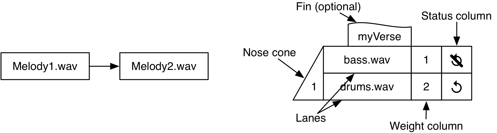
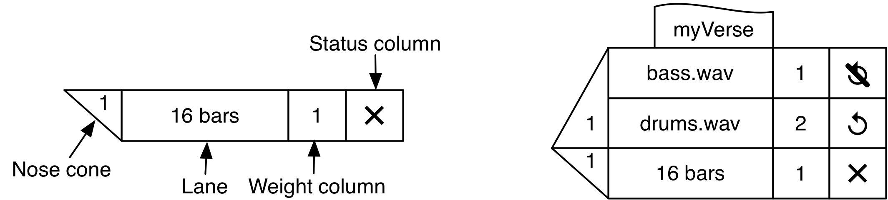
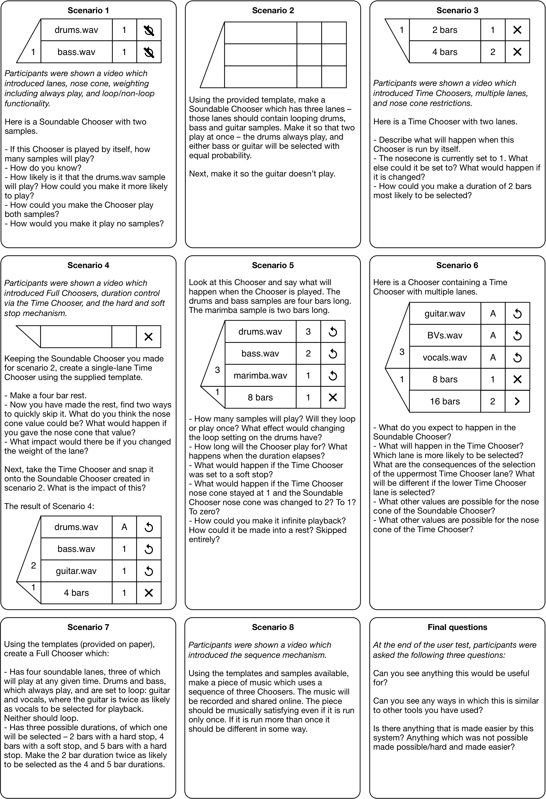
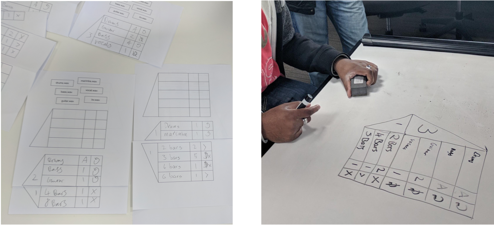

# Abstract

Algorithmic music composition involves specifying music in such a way that it is non-deterministic on playback, leading to music which has the potential to be different each time it is played. Current systems for algorithmic music composition typically require the user to have considerable programming skill and may require formal knowledge of music. However, much of the potential user population are music producers and musicians (some professional, but many amateur) with little or no programming experience and few formal musical skills. To investigate how this gap between tools and potential users might be better bridged we designed Choosers, a prototype algorithmic programming system centred around a new abstraction (of the same name) designed to allow non-programmers access to algorithmic music composition methods. Choosers provides a graphical notation that allows structural elements of key importance in algorithmic composition (such as sequencing, choice, multi-choice, weighting, looping and nesting) to be foregrounded in the notation in a way that is accessible to non-programmers. In order to test design assumptions a Wizard of Oz study was conducted in which seven pairs of undergraduate Music Technology students used Choosers to carry out a range of rudimentary algorithmic composition tasks. Feedback was gathered using the Programming Walkthrough method. All users were familiar with Digital Audio Workstations, and as a result they came with some relevant understanding, but also with some expectations that were not appropriate for algorithmic music work. Users were able to successfully make use of the mechanisms for choice, multi-choice, looping, and weighting after a brief training period. The 'stop' behaviour was not so easily understood and required additional input before users fully grasped it. Some users wanted an easier way to override algorithmic choices. These findings have been used to further refine the design of Choosers.

# Introduction

Algorithmic composition typically involves structural elements such as indeterminism, parallelism, choice, multi-choice, recursion, weighting, and looping [@Jacob:1996aa]. There are powerful existing tools, such as Max (Puckette, 1991) and SuperCollider (McCartney, 2002) for manipulating these and other elements of music. However, while these systems give great compositional power to musicians who are also skilled programmers (Wilson et al., 2011), many musicians who are not also expert programmers find these tools inaccessible and difficult to understand and use (Bullock et al., 2011).

This paper presents an evaluation of a prototype visual programming language (Bellingham et al., 2017) designed to allow structural elements of the kind involved in algorithmic music composition to be readily visualised and manipulated, while making little or no demand on programming ability. This system, called Choosers, centres around a novel non-standard programming abstraction (the Chooser) which controls indeterminism, parallelism, choice, multi-choice, recursion, weighting, and looping.

In this paper we present a programming walkthrough evaluation carried out with seven pairs of undergraduate Music Technology students. The purpose of this evaluation is to:

-   Test the ability of self-taught music producers without programming skills to use Choosers to carry out a range of rudimentary algorithmic composition tasks;
-   Identify usability and user experience problems in the current design;
-   Identify tensions and trade-offs in the interaction design of the system.

In the evaluation, pairs of participants were introduced to each element of the graphical programming language via short tutorial videos. Participants were given a range of practical tasks to complete on paper or a whiteboard. The facilitator played a Wizard of Oz role, rapidly translating participants' graphical solutions into runnable code that was fed into a non-graphical prototype version of Choosers so that participants could hear the musical results of their attempts.

# Related work/problem setting

Various music programming languages are capable of algorithmic composition, although they require significant programming skills (Bullock et al., 2011) and are therefore inaccessible to many users. Bellingham et al. (2014) used the Cognitive Dimensions of Notations framework (Green and Petre, 1996) to review the usability of a representative selection of software capable of algorithmic music composition. The findings of the review included the following. First, we found that most existing software requires the user to have a considerable understanding of constructs in either graphical (e.g Max, Pure Data) or text-oriented (e.g. SuperCollider, ChucK, Csound) programming languages: such knowledge requires a significant learning overhead. Second, users are often required to have an understanding of musical notation and/or music production equipment such as mixing desks and patchbays. Third, several programs imposed working practices unconducive to compositional processes. Fourth, in some cases the user was unable to define, and subsequently change, the musical structure. Finally, complex visual design in graphical programming languages led to patches with multiple connections, making them difficult to read and to navigate.

# Introduction to the system: Choosers

The following section provides a brief overview of Choosers, designed to cover enough detail to allow readers to understand the evaluation. Full details of the system design can be found in Bellingham et al. (2017). The system has general musical expressivity, but for simplicity the present evaluation focuses on the manipulation of samples for algorithmic composition.

**Samples** are shown in boxes, and can be auditioned by clicking on them. Samples can be assembled into **sequences** using arrows (see @fig:samples). Samples in a sequence play in the order indicated by the direction of the arrows. Only a single arrow can enter or exit each element in a sequence. This deliberate limitation reflects the fact that parallelism and choice are dealt with elsewhere in the language. Boxes and sequences can be put inside other boxes, thereby packaging them into a single unit.

{#fig:samples}

Boxes referring to samples or sequences can be snapped together vertically to create what are known as **Choosers**. @fig:samples shows a Chooser with two lanes, each containing a sample (drums and bass). The number 1 in the nose cone indicates that at run time, just one of the lanes will be selected at random (subject to restrictions described below). By manipulating the number in the nose cone, any number of lanes from 0 to 2 can be chosen randomly to play simultaneously. A Chooser can have any number *n* of lanes. By manipulating the number in the nose cone, any number of lanes from 0 to *n* can be chosen randomly at run time and played simultaneously. Each lane has a weight associated with it. Consequently, in fig. 1, the drums are twice as likely to be chosen as the bass. Additionally, a weight of 'A' ('always play') can be used to ensure that the lane is always selected for playback.

Any sample can be set to **loop** indefinitely when selected on a particular run, or to play just once by the choice indicated in the status column (shown in fig. 1): indefinite looping of a single sample is typically not desired, so we now introduce **Time Choosers** (see fig. 2, left).

{width="5.332807305336833in" height="1.2027296587926508in"}

Figure 2: An annotated Time Chooser (left); a Full Chooser (right)

If the Time Chooser (fig. 2, left) is attached to the bottom of the Chooser (fig. 1, right) this produces a **Full Chooser** (fig. 2, right). When the Full Chooser shown in fig. 2 is played, looped drums, if chosen, cannot play indefinitely, but will be cut off after 16 bars. However, if the status column in the time chooser were set to $>$ (indicating a **soft stop**) rather than $\times$ (indicating a **hard stop**) then, after 16 bars, the sample would play to the end of its current iteration. With a hard stop, if the Time Chooser duration cleanly divides the sample duration, every repetition will play in full. If not (e.g. if the bass.wav sample in fig. 2 had a duration of 3 bars) a hard stop will cut playback mid-sample. The two kinds of stop work similarly with non-looped lanes. If the non-looped bass lane of the Full Chooser (fig. 2, right) were chosen, the bass sample would be guaranteed to start playing once. With either kind of stop, if the sample were *less* than 16 bars long, there would be silence after completion until the end of the 16 bars. A non-looped sample longer than 16 bars would be truncated by a hard stop but allowed to complete by a soft stop.

Now that Time Choosers and Full Choosers have been introduced, in order to avoid ambiguity, we will refer to Choosers with no attached Time Choosers, such as those shown in fig. 1, as **Soundable Choosers**.

A Time Chooser can be used alone as part of a sequence -- however, when used in this way it will simply result in a **rest** of the specified duration. More generally, the purpose of a Time Chooser within a Full Chooser is to moderate in a non-deterministic manner how long the Soundable Chooser and its individual lanes play. Possible interactions between the settings of soundable and Time Choosers can make the results more varied than might be imagined. A Time Chooser's nose cone can be set to either one or zero. If set to one, one time lane will be chosen at run time. If it is set to zero no time lanes will be selected and the Soundable Chooser will run as though there is no Time Chooser. This allows for quick low viscosity (Green and Petre, 1996) arrangement changes, with the possibility of infinite playback if the Soundable Chooser lanes are set to loop. With no Time Chooser and the chosen lanes *not* set to loop, the samples will play and the Chooser will be released when they have finished playing, regardless of length.

# Method

## Participants

Seven pairs of undergraduate Music Technology students took part in user tests utilising a Wizard of Oz prototyping methodology. These users were targeted as they are typically lack programming skill and extensive formal music training. While they may be conversant with some elements of music theory, the predominant background is self-taught music producers with experience of making music electronically using Digital Audio Workstations (DAWs).

All participants were asked to complete a short questionnaire before taking part in the user tests. Of the fourteen participants all considered themselves musicians. Six participants did not read any music notation (though ten had some formal musical training). Most of the music readers could read common music notation as well as chord notation. All participants were familiar with DAWs, with Logic Pro (Apple Inc., 2013) mentioned by all fourteen users. Other DAWs mentioned included Pro Tools (6 mentions), Cubase (2 mentions), FL Studio (5 mentions), Reason (1 mention), and Ableton Live (1 mention). Pure Data (Puckette, 1997) a visual audio programming language, was mentioned by two participants. Twelve participants had experience using hardware for music performance HCI tasks (such as drum pads or control surfaces). The participants were not habitual performers; seven of the fourteen participants do not perform with or for others. Of those that do, three perform in church, and four occasionally play with friends in private. Five of the fourteen participants claimed some experience in computer programming; however, two of these considered markup for the web (HTML and CSS) as programming. If simple markup and layout are excluded, then more than two thirds of participants (11 out of 14) lack experience of writing algorithms in any programming language. One participant listed the use of Pure Data and SuperCollider. Eight of the fourteen participants did not know what algorithmic music was at the start of the user tests. The remaining six participants felt that they knew what algorithmic music was but had not created any.

## Walkthrough protocol

Participants were asked to take part in eight scenarios, as reproduced below. The users were free to discuss the work and to ask for clarification with the administrator of the test. Users were asked to act as active participants in the research, and to help in categorising any issues that were raised. The categorisations that users were asked to use -- taken from the programming walkthrough method (Bell et al., 1992, 1991) -- were questions (e.g. why does the loop do that?), problems (e.g. I don't understand what these lanes are for), suggestions (e.g. maybe the cone should be a different shape), and other observations (e.g. I like the fins). In addition, participants were asked if they could think of any other ways in which each scenario could be completed. This prompted a discussion on alternative routes in order to test understanding and to capture user expectations.

## Walkthrough scenarios

The eight scenarios issued as part of the user tests are shown in fig. 3. The users were introduced to each element of the graphical programming language via short tutorial videos[^1]. Users were given a range of practical tasks to complete on paper or on a whiteboard (see fig. 4), and their outputs were played by the facilitator using a set of SuperCollider (McCartney, 2002) classes written to implement the musical abstractions behind the system. The user tests were videoed and transcribed to assist in the analysis presented here.

{width="5.9750688976377955in" height="8.73611111111111in"}

Figure 3: The eight user test scenarios

## Results

All participants were able to understand the behaviour of Soundable Choosers. Twice participants had to be corrected after believing vertically stacked lanes all play concurrently -- both instances of this misunderstanding occurred in the first scenario only. Two groups found multiple vertically aligned time lanes confusing and assumed that both durations would play together, or one would play before the other. The initial introduction of a Time Chooser as a representing a rest, and only later showing it constraining a Soundable Chooser's duration, was confusing for four of the seven groups. Hard and soft stops were understood, but seven of the fourteen participants asked for clarification of the behaviour of the soft stop. Two pairs of participants suggested alternatives for the hard and soft stop icons. Two participants wanted to use 'always play' to express infinite playback rather than removing the Time Chooser. There was some confusion over the meaning of 'always play' and whether it could be skipped. Some felt the interface used numbers for too many parameters.

Three groups commented on the 'boring' design. The layout of Choosers was not seen as problematic, but some users wished for a more stylish and polished presentation. Two groups requested colours to enhance usability: within one group, one user wanted automatic colour selection (denoting lane type) and the other user felt that user-controlled colour selection would better support sorting and arrangement tasks. Several users were interested to know if lanes could be rearranged to visually organise lanes into instrument groups. One user suggested that lane arrangement could be an alternative to the weight column --- moving a lane higher would result in a higher probability of playback. This is similar to one mechanism which was considered and rejected before the user tests: it was replaced by the weight column as the column allows for multiple identical lane weights, quick auditioning, and user-controlled lane ordering to assist with musical arrangement. One user requested instrument icons for lanes, partly in response to being unaware of the marimba (one of the samples used in the user test).

Overall, participants were able to complete all scenario tasks, with varying levels of assistance.

{width="5.253502843394576in" height="2.4in"}

Figure 4: User work on paper and on a whiteboard

# Reflection on design issues

The findings from the user tests outlined above have various implications for the design of Choosers.

## Musical issues

Repeating phrases, and the musical interaction between phrases, are crucially important in a music system. These have therefore been brought to the surface via the loop and hard/soft stop behaviours. We found that the stop behaviour was confusing to four of the seven pairs of users, and the documentation will be enhanced to better explain the system. The hard and soft stop system can be conceptualised in a number of ways. For musicians, one useful way is to consider soft stops as suitable for melodies, and hard stops for accompaniment. Melodies are therefore allowed to finish, whereas accompanying elements are stopped when the duration of the Chooser elapses.

Three of the fourteen users were keen to have a visual indication of current position with respect to duration, such as a progress bar. While this seems a reasonable request, it is complicated by the non-deterministic nature of the system.

A significant number of participants found the use of Time Choosers for both rests and Chooser duration to be confusing. This was largely due to rests being introduced before the Time Chooser's primary function, which is to control the duration of a Chooser.

None of the participants had experience in algorithmic composition, so these sessions essentially introduced algorithmic compositional tools while also testing the interface. This led some participants to presume that the concepts themselves were novel. Some time was spent discussing the desirability of algorithmic processes rather than this specific implementation. Two participants assumed that the process would lead to a linear audio file, which indeed it can, but many use cases would require the music to remain nonlinear. Future evaluations could explore the nature of attitudes to nonlinear playback, including how it is related to expectations set by commercial music creation software and linear playback. We are also interested in the use of Choosers in genres which routinely incorporate extemporaneous changes and improvisation, such as folk and jazz.

One group specifically wanted a mechanism to allow them to easily reuse material for thematic development. The design of Choosers allows for this via the nesting of Choosers within lanes, although it was not included in the user tests for simplicity. The users were shown nesting in response to their questions and found it to meet the need they had expressed.

Choosers can be used in the creation of a range of music. However, given the unusual combination of usability and affordances, Choosers are particularly suited to music in which users would benefit from easy access to non-linear playback. Some classic Minimalism techniques (Potter, 2002), such as phasing (Scherzinger, 2005), are easily achievable using Choosers. Game music is often non-linear, created using layers of musical material which are triggered by in-game events (Collins, 2008). Such material can be created using Choosers, and we have a mechanism which would allow for external input via OSC or an alternative protocol; this would allow a game engine to trigger changes in the music. Choosers also allow musicians and music producers to create nonlinear versions of existing recordings by loading alternate takes into Choosers. The playback could range from very close to the original (e.g. algorithmically switching between vocal takes of the same melody) to playing significantly different material (e.g. branching to play different sections), depending on the decisions made by the creators.

## Programming-related issues

As shown in sec. 3, the Soundable Chooser nose cone slopes down and the Time Chooser nose cone slopes up -- this allows them to be joined together and communicates the required upper/lower order to the user. Interestingly, some users guessed the combination of Soundable and Time Choosers, suggesting that the nose cone shapes of the two Chooser types were effective in communicating their combinatorial usage.

The Chooser system is designed to allow for consistent logic to be applied across Soundable and Time Choosers where possible. Participants in the user tests successfully reused elements of the Soundable Chooser system when manipulating duration, but there were some cases where such reuse or re-contextualisation was not possible. Interestingly, the actions of the users in these cases would have made sense neither from a musical nor programming perspective, but the rationale behind these requests is instructive as it shows how users understand the tools in the system. For example, in scenario five (fig. 3) two participants wanted to use the 'A' (always play) mechanism to set infinite playback -- they wanted to override the set duration and had understood 'A' to be a global override control. In a similar example, one user wanted to be able to loop a Time Chooser. If the system were to be changed to allow for a set number of repeats, rather than an infinite loop, such a move may be desirable.

Users will also require access to metadata -- for example, to check the length of a sample loaded into a soundable lane in a Chooser. Such metadata could be shown via a tooltip, accessed by hovering the mouse over a lane.

## Shared and existing knowledge

One design motivation is to enable people to understand the system very quickly. The Chooser design tacitly draws on a number of systems of existing knowledge.

Some users wanted to be able to leverage their existing understanding of DAW software and found it frustrating that they needed to learn new paradigms for duration, synchronicity, and so on. This is an example of technological framing (Orlikowski and Gash, 1994). The knowledge gained by using other music software can be useful, but it can also prove problematic if the design of the software being learned is sufficiently differentiated. As a result, there is much to be gained by following standard design conventions where possible, as this maximises the user's ability to reuse existing knowledge. One interesting example was seen in scenario 6 (fig. 3), in which one pair of users learned the rules of Choosers and then wanted to use the same rules elsewhere.

Technological framing, and the expectations set by the use of commercial DAWs, may be an influence on user requests for a progress bar and the conversations on the desirability of nonlinear vs. linear playback that took place during the user tests (as considered in sec. 5.1).

## Metaphor

Interface metaphors are very common and can be useful in communicating the roles of the software and setting realistic expectations when users are familiar with the original interface. However, such metaphors can become problematic if users are not familiar with the original interface.

Related to technological framing is the assumption, ubiquitous in Digital Audio Workstations, that signal flow and processing will be applied using a mixing desk metaphor. Such virtual desks often make use of skeuomorphism (such as the fader caps and rotary potentiometers in Pro Tools), although some other designs have made graphical changes while retaining the overall layout. As an example, Ardour's use of a textured 'strip' instead of a fader is still skeuomorphic as it makes use of a ribbon controller metaphor but, in an attempt to improve mouse control by increasing the size of the target, it does not follow the traditional desk layout.

Given that DAWs are now capable of performing all mixdown tasks, and the financial cost of consoles and outboard effects processors can be prohibitive, many users learn in a virtual studio environment rather than on hardware. Many DAWs were designed to mimic hardware in order to leverage existing knowledge and ease the transition from hardware to software. However, now most people are introduced to music production via software, and many do not use hardware, there is an opportunity to revisit some design assumptions.

Some users felt that the user interface was 'boring', lacking the use of colour, metaphor, and skeuomorphic design common in DAWs. This may be another example of technological framing (Orlikowski and Gash, 1994). We can also consider the impact of metaphor in music software by making use of the Cognitive Dimensions of Notations (Green and Petre, 1996). Using this framework, the closeness of mapping and role expressivity of a mixing desk can be implied by making a software recreation look and function like hardware.

Some users had difficulty understanding the outcome of hard and soft stops in Choosers. The vast majority of music production software is focussed on the creation of linear music, and the concept of 'play until finished' is rarely implemented. As a result, none of the user test participants had encountered it, and did not have a frame of reference for why it might be desirable. As a result, there is not a clear existing metaphor for what we refer to here as a 'soft' stop. Users agreed that the $\times$ icon represented a traffic stop sign and that it was a suitable analogy for 'stop now', but the $>$ icon used for a soft stop was not immediately understood as there is no readily accessible metaphor.

## Arithmetic

The use of numbers and arithmetic relationships in an interface can be a valuable organising tool, as they are more or less universally familiar and can concisely represent many relationships. The decision to use numbers for several parameters was motivated by parsimony and consistency. However, the use of numbers for multiple parameters was perceived as negative by three participants. Upon questioning, the issue was that numbers meant different things in different parts of the interface. The Chooser design presented to participants in the user tests made use of integers in five different ways: for the number of simultaneously playing soundable elements, weight, duration, repeats, and Time Chooser on/off. Despite this, for different reasons, the user issues surrounding the 'always play' option led us to consider extending the range of numerical concepts used in the interface, by allowing the metaphorical use of $\infty$ as a weight (to outrank any positive integer weight) as discussed in the next section.

In sec. 6, we propose changes to Chooser design to address these various issues.

# Design problems and candidate solutions in Choosers

Given the problems for some users with the use of integers for multiple parameters (see sec. 5.5), we propose the use of a simple on/off icon for the Time Chooser nose cone. Interestingly, one pair of users suggested this change in the user tests. Scenario five (fig. 3) showed that two users wanted to leverage the 'always play' mechanism beyond the weight column, and one user wanted to set the duration of a time lane to infinity. We propose a change to Choosers which allows for both mechanisms.

We propose a design change which allows the user to allocate a maximum possible weight ($\infty$) for a lane, thereby guaranteeing that it will play if the nose cone number is high enough to allow all such lanes to play. When allowing $\infty$ as a weight, a useful metaphor is to think of lanes with weight $\infty$ as having paid for 'priority boarding', as when boarding an aircraft. Lanes with weight $\infty$ will always be chosen before any lanes with any finite weight. Compared with the 'always play' mechanism, this has the potential for greater clarity when the number of maximally-weighted lanes exceeds the number of the nose cone. In such cases, under the current 'always play' system it is not obvious whether 'always play' should override the nose cone or vice versa. Under the proposed system, the nose cone would determine the number of lanes to play, and if that was less than the number of lanes with weight $\infty$, the winners would be chosen from those lanes at random. We are also considering the use of a maximum value ($\infty)$ for the nose cone of a Soundable Chooser ('play all available lanes') and for the duration of a time lane ('play forever').

We propose that future work will introduce Time Choosers in the context of a Full Chooser, with the rest functionality introduced later as a special case. Tutorial materials will provide a clear explanation and will offer context and examples. The value of all of these proposed changes will be tested empirically.

# Conclusions

Choosers were developed to allow non-programmers access to algorithmic composition tools and processes. The design principles were to leverage parsimony in order to enhance learnability; to surface musically meaningful actions, and to make them quick and easy; to allow both bottom-up and top-down construction; and to make use of progressive disclosure to allow for advanced use without harming usability for beginners.

The user tests outlined here show that non-programmers were able to successfully use Choosers to create a number of short pieces of music. Future work will focus on the refinement and re-evaluation of the Chooser notation and supporting materials.

# References {#references-1 .ListParagraph}

Apple Inc. (2013) 'Logic Pro X', International Computer Music Conference.

Bell, B., Citrin, W. V., Lewis, C. and Rieman, J. (1992) 'The Programming Walkthrough: A Structured Method for Assessing the Writability of Programming Languages; CU-CS-577-92', Computer Science Technical Reports, vol. Paper 554.

Bell, B., Rieman, J. and Lewis, C. (1991) 'Usability Testing of a Graphical Programming System: Things We Missed in a Programming Walkthrough', Proceedings of the SIGCHI Conference on Human Factors in Computing Systems, CHI '91, New York, NY, USA, ACM, pp. 7--12.

Bellingham, M., Holland, S. and Mulholland, P. (2014) 'A Cognitive Dimensions analysis of interaction design for algorithmic composition software', Boulay, B. du and Good, J. (eds), Proceedings of Psychology of Programming Interest Group Annual Conference 2014, University of Sussex, pp. 135--140.

Bellingham, M., Holland, S. and Mulholland, P. (2017) 'Choosers: designing a highly expressive algorithmic music composition system for non-programmers', 2nd Conference on Computer Simulation of Musical Creativity.

Bullock, J., Beattie, D. and Turner, J. (2011) 'Integra Live: a new graphical user interface for live electronic music', International Conference on New Interfaces for Musical Expression.

Collins, K. (2008) Game Sound: An Introduction to the History, Theory, and Practice of Video Game Music and Sound Design, Cambridge, MA, MIT Press.

Green, T. R. and Petre, M. (1996) 'Usability Analysis of Visual Programming Environments: a 'cognitive dimensions' framework', Journal of Visual Languages and Computing, vol. 7, pp. 131--174.

Jacob, B. L. (1996) 'Algorithmic Composition as a model of creativity', Organised Sound, Cambridge University Press, vol. 1, no. 3, pp. 157--165.

McCartney, J. (2002) 'Rethinking the Computer Music Language: SuperCollider', Computer Music Journal, vol. 26, no. 4, pp. 61--68.

Orlikowski, W. J. and Gash, D. C. (1994) 'Technological Frames: Making Sense of Information Technology in Organizations', ACM Transactions on Information and System Security, New York, NY, USA, ACM, vol. 12, no. 2, pp. 174--207.

Potter, K. (2002) Four Musical Minimalists: La Monte Young, Terry Riley, Steve Reich, Philip Glass, Cambridge University Press, vol. 11.

Puckette, M. (1991) 'Combining Event and Signal Processing in the MAX Graphical Programming Environment', Computer Music Journal, The MIT Press, vol. 15, no. 3, pp. 68--77.

Puckette, M. (1997) 'Pure Data', ICMC.

Scherzinger, M. (2005) 'Curious Intersections, Uncommon Magic: Steve Reich's It's Gonna Rain', Current musicology, vol. 79, pp. 207--244.

Wilson, S., Cottle, D. and Collins, N. (2011) The SuperCollider Book, MIT Press.

[^1]: Available at https://goo.gl/PFeAJf
