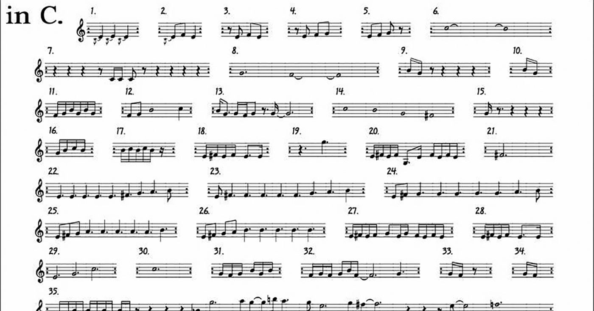

# Algorithmic music composition

* The partial or total automation of music composition by formal, computational means [@Fernandez2013-zp];
* Structural elements such as indeterminism, parallelism, choice, multi-choice, recursion, weighting, and looping [@Jacob1996-zf];
* Many musicians are not programmers and find existing tools difficult to use [@Bullock2011-sw].

# Problem setting --- from PPIG 2014

* Existing tools require an understanding of programming languages;
* Many require an understanding of musical notation and/or music production equipment;
* Several programs impose working practices unconducive to compositional processes;
* In some cases the user was unable to define, and subsequently change, the musical structure;
* Complex graphical patches were hard to read and edit --- spaghetti.

# Design principles

New programming abstraction (the Chooser) to enable algorithmic music composition by non-programmers.

* Parsimony --- a small number of consistent powerful ideas do the work combinatorially;
* Musically meaningful structuring actions are simple and quick to do;
* Both bottom-up and top-down construction are allowed in any combination;
* Affordances are designed for a wide range of users --- children to experts --- via progressive disclosure.

# Brief overview of Choosers

{width=40%}

{width=60%}

# Brief overview of Choosers

# Example 1 --- using phrases from *In C*

<!--

-->

# Brief overview of Choosers

<!--
# Brief overview of Choosers

# Brief overview of Choosers

# Hard and soft stops

-->

# Brief overview of Choosers

# Example 2 --- *Nine Inch Nails*

{width=80%}

# User tests

To test the ability of self-taught music producers to use Choosers to carry out a range of rudimentary algorithmic composition tasks; identify usability and user experience problems, tensions, and trade-offs.

* Seven pairs of users --- participants were neither programmers nor traditional musicians;
* Users were active participants using the programming walkthrough method [@Bell1991-uw; @Bell1992-cn], including categorisation of issues into:
	* Questions;
	* Suggestions;
	* Observations.
* Wizard of Oz prototyping.

# User tests

![Users were given a range of practical tasks (reproduced in the paper) to complete on paper or on a whiteboard, with outputs played by the facilitator using a set of SuperCollider classes [@McCartney2002-uz].](images/userwork.pdf)

# Results --- musical issues

* All participants understood the system and were successful, with varying levels of assistance;
* Discussions on the desirability of algorithmic music;
* Stops and rests were initially confusing to some;
* Progress bar request --- reasonable, but difficult in a nondeterministic system.

# Results --- programming-related issues

* Nose cone shapes were effective in communicating their combinatorial usage;
* Reuse or re-contextualisation of logic was observed, but didn’t make sense in some contexts --- the rationale behind these requests is instructive;
* Users required access to metadata.

# Results --- shared and existing knowledge

* A desire to leverage existing DAW knowledge and skill, which brought some frustration --- expert in one environment, novice in another;
* Technological framing [@Orlikowski1994-mi] and the expectations set by commercial DAWs as an influence on user requests.

# Results --- metaphor

* Useful when users are familiar with the original interface;
* Is it time to revisit some design assumptions in music production software?
* Hard and soft stops --- no clear existing metaphor for a soft stop --- both for the function and the icon.

# Results --- arithmetic

* Numbers are universally familiar and can concisely represent many relationships. Their use was motivated by parsimony and consistency. However ...
* The use of numbers for multiple parameters was perceived as negative by three participants ('too many numbers man!').

# Ongoing work --- updated design for second user test

{width=70%}

# References {.allowframebreaks}
